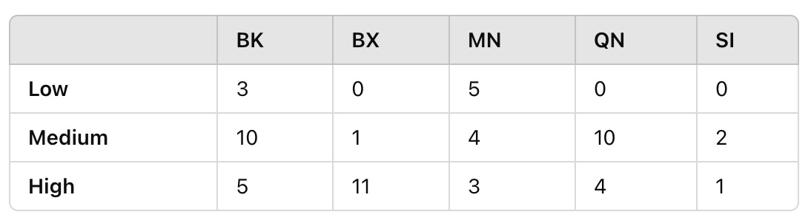
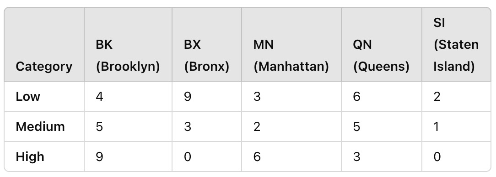

```{r setup, include=FALSE}
knitr::opts_chunk$set(echo = TRUE)
```

## Load Required Libraries

```{r cars}
library(tidyverse)
library(readr)
library(ggplot2)

```

## Load Cleaned Data

```{r}
# Load the cleaned dataset
data <- read_csv("data/cleaned_housing_risk_data.csv")

# Normalize the total risk score
data$total_risk_score <- data$total_risk_score / 36

head(data)
```


## Analyze Eviction and Foreclosure Rates

```{r}
# Summary statistics for eviction and foreclosure rates
eviction_foreclosure_stats <- data %>%
  summarise(
    mean_eviction_rate = mean(rate_eviction_filings, na.rm = TRUE),
    median_eviction_rate = median(rate_eviction_filings, na.rm = TRUE),
    mean_foreclosure_rate = mean(rate_forclosure_filings, na.rm = TRUE),
    median_foreclosure_rate = median(rate_forclosure_filings, na.rm = TRUE)
  )

# Print summary statistics
print(eviction_foreclosure_stats)

```

## Visualize Eviction and Foreclosure Rates

### Eviction Rates by District

```{r}
evic_dist <- ggplot(data, aes(x = reorder(district, rate_eviction_filings), y = rate_eviction_filings, fill = rate_eviction_filings)) +
  geom_bar(stat = "identity") +
  coord_flip() +
  theme_minimal() +
  labs(
    title = "Eviction Rates by District",
    x = "District",
    y = "Eviction Rate"
  )

evic_dist

ggsave("figures/evic_dist.png", plot = evic_dist, width = 8, height = 6)

  
```

### Foreclosure Rates by District

```{r}
for_dist <- ggplot(data, aes(x = reorder(district, rate_forclosure_filings), y = rate_forclosure_filings, fill = rate_forclosure_filings)) +
  geom_bar(stat = "identity") +
  coord_flip() +
  theme_minimal() +
  labs(
    title = "Foreclosure Rates by District",
    x = "District",
    y = "Foreclosure Rate"
  )

for_dist

ggsave("figures/for_dist.png", plot = for_dist, width = 8, height = 6)

```

### Correlation Between Eviction and Foreclosure Rates

```{r}
corr_evic_for <- ggplot(data, aes(x = rate_eviction_filings, y = rate_forclosure_filings)) +
  geom_point(alpha = 0.6) +
  geom_smooth(method = "lm", color = "blue") +
  theme_minimal() +
  labs(
    title = "Eviction vs Foreclosure Rates",
    x = "Eviction Rate",
    y = "Foreclosure Rate"
  )

corr_evic_for

ggsave("figures/corr_evic_for.png", plot = corr_evic_for, width = 8, height = 6)

```

## Compare Borough-Level Trends
### Aggregate Data by Borough

```{r}
housing_by_borough <- data %>%
  mutate(borough = str_extract(district, "^[A-Z]+")) %>%
  group_by(borough) %>%
  summarise(
    avg_eviction_rate = mean(rate_eviction_filings, na.rm = TRUE),
    avg_foreclosure_rate = mean(rate_forclosure_filings, na.rm = TRUE)
  )

# Preview borough-level summary
print(housing_by_borough)

```

### Borough-Level Eviction and Foreclosure Rates

```{r}
# Eviction Rates by Borough
ggplot(housing_by_borough, aes(x = reorder(borough, avg_eviction_rate), y = avg_eviction_rate, fill = avg_eviction_rate)) +
  geom_bar(stat = "identity") +
  coord_flip() +
  theme_minimal() +
  labs(
    title = "Average Eviction Rates by Borough",
    x = "Borough",
    y = "Eviction Rate"
  )

# Foreclosure Rates by Borough
ggplot(housing_by_borough, aes(x = reorder(borough, avg_foreclosure_rate), y = avg_foreclosure_rate, fill = avg_foreclosure_rate)) +
  geom_bar(stat = "identity") +
  coord_flip() +
  theme_minimal() +
  labs(
    title = "Average Foreclosure Rates by Borough",
    x = "Borough",
    y = "Foreclosure Rate"
  )

```

## Correlation Analysis

```{r}
# Correlation matrix for housing-related variables
housing_correlation <- data %>%
  select(rate_eviction_filings, rate_forclosure_filings, total_risk_score) %>%
  cor(use = "pairwise.complete.obs")

# Print the correlation matrix
print(housing_correlation)

```

## Chi Squared Test

### Categorize the Eviction Rates

```{r}
# Example: Divide eviction rates into categories
data <- data %>%
  mutate(eviction_rate_category = cut(rate_eviction_filings,
                                      breaks = c(-Inf, 0.02, 0.05, Inf),
                                      labels = c("Low", "Medium", "High")))

# Check if eviction_rate_category was created successfully
table(data$eviction_rate_category)

data <- data %>%
  mutate(borough = str_extract(district, "^[A-Z]+"))

# Check unique borough values
print(unique(data$borough))

if (any(is.na(data$borough))) {
  warning("Some rows in 'borough' column are missing.")
}

print(length(data$eviction_rate_category))
print(length(data$borough))

```

### Create a Contingency Table - Evictions

```{r}
# Create the contingency table
contingency_table <- table(data$eviction_rate_category, data$borough)
print(contingency_table)


```

#### Interpretation:

> The contingency table represents the frequency of districts in each eviction_rate_category (Low, Medium, High) by borough:



### Run the Chi-Squared Test - Evictions

```{r}
# Run the test given that the contingency table has sufficient entries - should work
if (all(dim(contingency_table) > 1)) {
  chi_squared_test <- chisq.test(contingency_table)
  print(chi_squared_test)
} else {
  warning("Contingency table has insufficient data for Chi-Squared Test.")
}


```

#### Significant Result: Evictions

> The p-value ($p<0.05$) indicates a significant association between eviction rate categories and boroughs. This means that the distribution of eviction rates differs significantly across boroughs.


### Categorize the Foreclosure Rates
```{r}
# Example: Divide foreclosure rates into categories
data <- data %>%
  mutate(foreclosure_rate_category = cut(rate_forclosure_filings,
                                         breaks = c(-Inf, 0.005, 0.01, Inf),
                                         labels = c("Low", "Medium", "High")))

# Check if foreclosure_rate_category was created successfully
table(data$foreclosure_rate_category)

# Check unique borough values
data <- data %>%
  mutate(borough = str_extract(district, "^[A-Z]+"))

print(unique(data$borough))

```

### Create a Contingency Table - Foreclosure
```{r}
# Create the contingency table for foreclosure rate categories by borough
contingency_table_foreclosure <- table(data$foreclosure_rate_category, data$borough)
print(contingency_table_foreclosure)

```



### Run the Chi-Squared Test - Foreclosure

```{r}
# Run the test given that the contingency table has sufficient entries
if (all(dim(contingency_table_foreclosure) > 1)) {
  chi_squared_test_foreclosure <- chisq.test(contingency_table_foreclosure)
  print(chi_squared_test_foreclosure)
} else {
  warning("Contingency table has insufficient data for Chi-Squared Test.")
}

```

## Expected Frequencies for Validation

```{r}
# View expected frequencies for the foreclosure rates
if (exists("chi_squared_test_foreclosure")) {
  print(chi_squared_test_foreclosure$expected)
}

```

## Attempting Fisher's Exact Test 

```{r}
# Run Fisher's Exact Test for foreclosure rates (if necessary)
if (any(chi_squared_test_foreclosure$expected < 5)) {
  fisher_test_foreclosure <- fisher.test(contingency_table_foreclosure)
  print(fisher_test_foreclosure)
}

```


## Visualoize Foreclosure Rate Cateogires by Borough
```{r}
# Visualize the contingency table as a heatmap
ggplot(as.data.frame(as.table(contingency_table_foreclosure)), aes(x = Var2, y = Var1, fill = Freq)) +
  geom_tile() +
  scale_fill_gradient(low = "white", high = "red") +
  theme_minimal() +
  labs(title = "Foreclosure Rate Categories by Borough", x = "Borough", y = "Foreclosure Rate Category")

```

