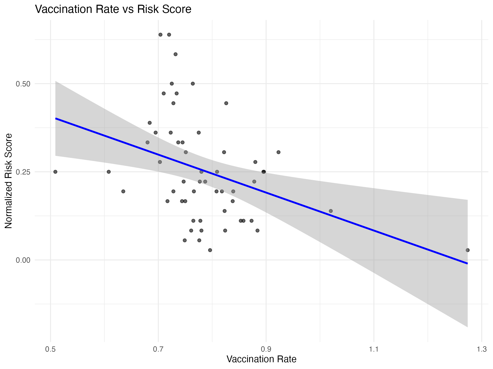
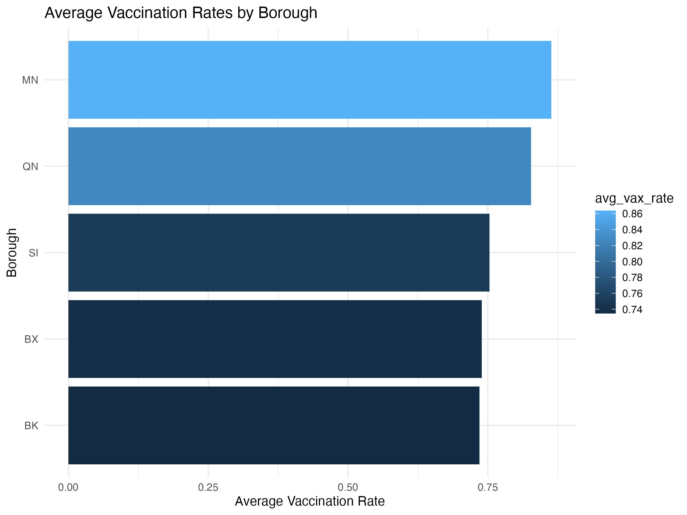

# DSAN 5100 - Final
 

## **Project Overview**
This project investigates the relationship between public health metrics and housing risk scores in various districts. By analyzing vaccination rates, death rates, uninsured percentages, and housing-related factors, the study seeks to identify disparities and potential areas for policy intervention.

---

## **Research Question**

**What are the key factors contributing to high housing risk scores across districts, and how do public health and socioeconomic indicators correlate with these risks?**

---

## **Datasets**

The dataset used in this project includes housing risk scores and a variety of public health and socioeconomic metrics:

- **Source**: [Dataset](https://datawrapper.dwcdn.net/XDEVF/11/)
- **Features**:
  - COVID-19 Vaccination & Death Rates
  - Percent Uninsured
  - Crowding Percent
  - Area Median Income Percent
  - Percent People of Color (POC)
  - Rent Burden Percent
  - Eviction Filings Rate
  - Tenant Cases Rate
  - Housing Violations Rate
  - Unplanned Outages Rate
  - Change in Median Gross Rent
  - Change in Sale Price
  - Number of New Unaffordable Units
  - Rate for Foreclosure Filings
  - Share of Nonbank Small Home Loans
  - Total Housing Risk Score

---

## **Key Findings**

### **1. Public Health Metrics and Risk Scores**

1. **Vaccination Rate vs. Risk Score**:
   - **Trend**: Negative correlation.
   - **Insight**: Higher vaccination rates correlate with lower housing risk scores, indicating better public health infrastructure.
   - 

2. **Death Rate vs. Risk Score**:
   - **Trend**: Positive correlation.
   - **Insight**: Districts with higher death rates tend to have higher risk scores, reflecting potential disparities in healthcare access.
   - 

3. **Uninsured Percent vs. Risk Score**:
   - **Trend**: Positive correlation.
   - **Insight**: Higher uninsured percentages are linked to increased housing risks, suggesting the importance of health insurance coverage.
   - 

### **2. Borough-Level Comparisons**

- The Bronx (BX) has the **highest average risk scores** and **death rates**.
- Manhattan (MN) leads in **vaccination rates** and has the **lowest death rates**.
- Queens (QN) has the **highest uninsured percent**.

**Visuals**:  

- Risk Scores by Borough: 
- Death Rates by Borough: 
- Vaccination Rates by Borough: 
- Uninsured Percent by Borough: 

---

## **Statistical Methods**

### **1. Hypothesis Testing**

1. **T-Test for Vaccination Rates**:
   - Districts with above-median vaccination rates have significantly lower risk scores compared to those below median rates.
   - **p-value**: 0.00017 (statistically significant).

2. **ANOVA for Uninsured Percent**:
   - Significant differences in risk scores exist among groups with low, medium, and high uninsured percentages.
   - **p-value**: 1.39e−05 (highly significant).

### **2. Correlation Analysis**

- Strong correlations exist between public health metrics like limited English proficiency and rent burden.
- **Figure**: 

---

## **Data Visualizations**

### **Public Health Metrics**

- **Vaccination Rates**:  
  

- **Death Rates**:  
  

- **Uninsured Percent**:  
  

### **Risk Scores**

- **Top 20 Districts by Risk Scores**:  
  

---

## **Presentation Structure**

1. **Introduction**:
   - Explain the research question and its importance.
2. **Exploratory Data Analysis (EDA)**:
   - Share general findings and insights.
   - Time Allocation: 3 minutes.
3. **Public Health Analysis**:
   - Detailed analysis of vaccination rates, death rates, and uninsured percentages.
   - Time Allocation: 3 minutes.
4. **Statistical Results**:
   - Explain hypothesis tests, correlations, and implications.
5. **Conclusion**:
   - Summarize findings and policy recommendations.
   - Highlight actionable takeaways.

---

## **Next Steps**

1. **Expand Dataset**:
   - Include individual complaint data to analyze specific housing issues.
2. **Advanced Analysis**:
   - Implement Bayesian methods to estimate probabilities of high-risk outcomes under various conditions.
3. **Policy Recommendations**:
   - Focus on reducing uninsured rates and improving vaccination coverage in high-risk districts.

---

## **Authors and Contacts**

For any inquiries or further collaboration, please reach out to the project authors:

- [Alivia Castor](mailto:soc11@georgetown.edu)
- [Amanda Hao](mailto:alh326@georgetown.edu)
- [Satomi Ito](mailto:si408@georgetown.edu)
- [Mandy Sun](mailto:ms4821@georgetown.edu)
- [Jeffrey Kolbeins](mailto:jjk142@georgetown.edu)

--- 

